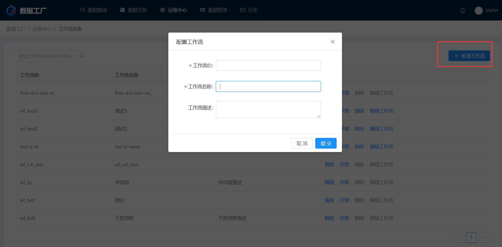
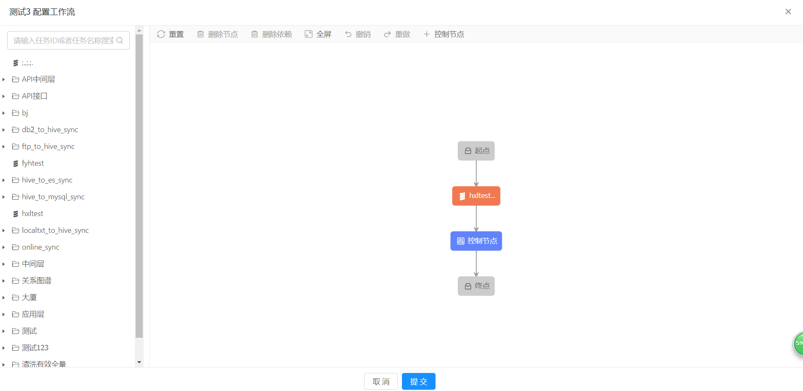
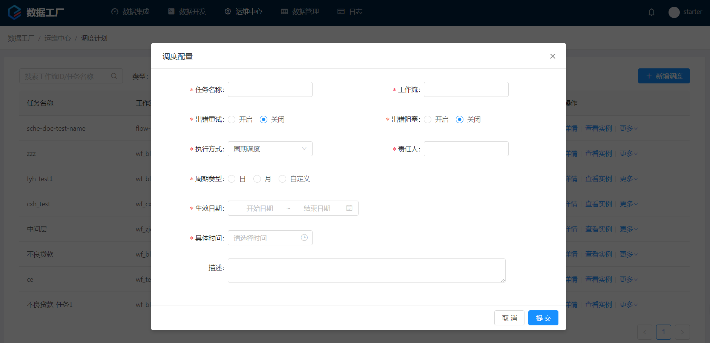
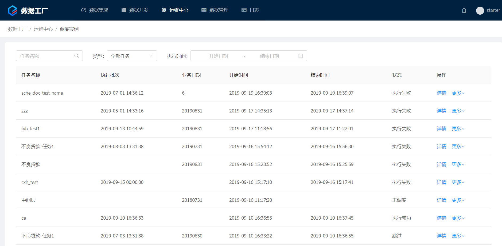
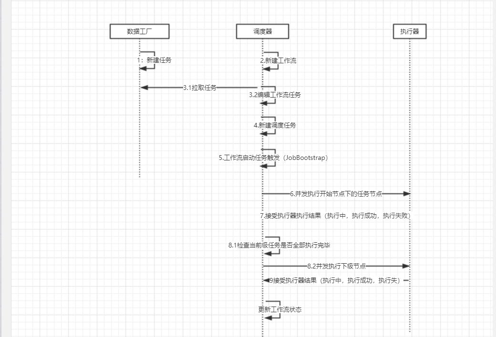

# 版本更新信息

## [2.1.1](http://124.207.118.198:8090/zentao/task-view-350.html)
* 支持调度时的参数设置，支持表达式语法
* 并行控制，支持最大并发数为 5
* 修复了 Task 依赖相关的 Bug
* server 与 client 版本分离

# 系统参数

支持使用 #*expr*、@*expr* 表达式计算参数值，其中 #*expr* 表示参数引用，@*expr* 表示静态引用
```
// 拼接字符串
 str = #strParam + 'some'

// 截取前 3 个字符
str = #strParam.subString(0, 3)

// 取参数 p1,p2 中较大值
@Math@max(#p1, #p2)
```

系统参数表：

|变量|变量名|参数类型|描述|
|--|--|--|--|
|idc.shouldFireTime|调度日期|[LocalDateTime](#localdatetime)|无

# 支持的方法调用

## LocalDateTime

## 批次时间上个月的最后一天
````
#idc.shouldFireTime.plusMonths(-1).with(@TemporalAdjusters@lastDayOfMonth()).format('yyyyMMdd')
````

表达式|返回值|描述|示例
--|--|--|--
plusMonths(int d)|LocalDateTime|上或下 d 月|*#ldt.plusMonths(1)* 下月当前时间
plusDays(int d)|LocalDateTime|前或后 d 天|*#ldt.plusDays(-2)* 前两天当前时间
plusWeeks(int d)|LocalDateTime|上或下 d 周|*#ldt.plusWeeks(-1)* 上周当前时间
withDayOfMonth(int d)|LocalDateTime|指定日期为 d|*#ldt.withDayOfMonth(1)* 本月 1 号
format(String fmt)| String | 格式化|*#ldt.format('yyyyMMdd')* 格式化为yyyyMMdd
with(TemporalAdjuster adjuster)|LocalDateTime|通过指令调节日期|*#ldt.with([@TemporalAdjusters@lastDayOfMonth()](#@TemporalAdjusters))*本月最后一天


```
// loadDate 为调度日期的前 20 天，格式化为  yyyyMMdd
#idc.shouldFireTime.plusDays(-20).format('yyyyMMdd')

// loadDate 为调度日上月最后一天，格式化为 yyyy-MM-dd
#idc.shouldFireTime.withDayOfMonth(1).plusDays(-1).format('yyyy-MM-dd')
```

# 支持的静态引用

## @TemporalAdjusters
表达式|返回值|描述|示例
--|--|--|--|--
@firstDayOfMonth()|TemporalAdjuster|本月第一天|*@TemporalAdjusters@firstDayOfMonth()*
@lastDayOfMonth()|TemporalAdjuster|本月最后一天|*@TemporalAdjusters@lastDayOfMonth()*
@firstDayOfYear()|TemporalAdjuster|本年第一天|*@TemporalAdjusters@firstDayOfYear()*
@lastDayOfYear()|TemporalAdjuster|本年最后一天|*@TemporalAdjusters@lastDayOfYear()*

# 新增工作流
idc_workflow (工作流任务表)
| 属性          | 描述           | 类型    | 字段值说明       |
| :------------ | -------------- | ------- | ---------------- |
| idc_workflow  | 主键ID         | varchar | 前端手动填入     |
| workflow_name | 工作流任务名称 | varchar | 前端手动填入     |
| props         | 前端参数       | varchar | 暂时未用         |
| updatetime    | 记录变化时间   | date    | 每次新增程序传入 |


# 保存工作流任务
idc_workflow_edge （工作流路径描述表）   

| 属性        | 描述             | 类型    | 字段值说明         |
| :---------- | ---------------- | ------- | ------------------ |
| workflow_id | 工作流ID 主键    | varchar | idc_workflow主键ID |
| id          | 组合标记ID  主键 | varchar | sourceId + targeId |
| source      | 起点任务ID       | varchar | 起点任务ID         |
| target      | 下次节点任务ID   | varchar | 下次节点任务ID     |

idc_node_task（工作流节点路径）

| 属性         | 描述          | 类型    | 字段值说明                          |
| :----------- | ------------- | ------- | ----------------------------------- |
| workflow_id  | 工作流ID 主键 | varchar | idc_workflow主键ID                  |
| id           | 主键ID        | varchar | 主键ID                |
| task_id      | 任务ID        | varchar | 前端传入数据工厂带入                |
| task_name    | 任务名称      | varchar | 前端填入                            |
| task_group   | 任务组        | varchar | 暂未使用                            |
| task_type    | 任务类型      | varchar | SIMPLE 简答任务；WORKFLOW工作流任务 |
| domain       | 任务域        | varchar | IDC,DATA-FACTORY-EXECUTOR           |
| description  | 描述          | varchar | 暂未使用                            |
| content_type | 数据类型      | varchar | SCALA,DATA_SYNC                     |


# 新增调度
idc_task(调度任务表)

| 属性           | 描述                     | 类型    | 字段值说明           |
| :------------- | ------------------------ | ------- | -------------------- |
| task_name      | 计划名 主键              | varchar |                      |
| task_group     | 计划组                   | varchar | primary 默认值       |
| workflow_id    | 工作流ID                 | varchar | 前端传入数据工厂带入 |
| domain         | 任务域（使用微服务名称） | varchar |                      |
| description    | 描述                     | varchar |                      |
| task_type      | 任务类型                 | varchar | WORKFLOW工作流任务   |
| assignee       | 责任人                   | varchar | 前端传入             |
| is_retry       | 重试                     | varchar | 0否  1是             |
| start_datetime | 生效时间                 | varchar | 前端传入             |
| end_datetime   | 失效时间                 | varchar | 前端传入             |
| schedule_type  | 调度类型                 | varchar | MANUAL手动，AUTO自动 |
| params         | 参数                     |         |                      |
| props          | 前端参数                 |         |                      |
| createtime     | 创建时间                 |         |                      |
| updatetime     | 更新日期                 |         |                      |
| block_on_error | 出错时阻塞               | varchar | 0 否 1是             |
| duetime        | 具体时间                 |         | 时分秒               |


# idc_job(新增工作流Job)

| 属性             | 描述                                           | 类型     | 字段值说明                                                   |
| :--------------- | ---------------------------------------------- | -------- | ------------------------------------------------------------ |
| id               | 主键                                           | varchar  |                                                              |
| task_name        | 调度名                                         | varchar  |                                                              |
| task_group       | 调度组                                         | varchar  |                                                              |
| job_type         | 实例类型                                       | varchar  | MANUAL手动，AUTO自动                                         |
| assignee         | 责任人                                         | varchar  |                                                              |
| load_date        | 业务日期                                       | varchar  | 添加任务调度时传入                                           |
| state            | 状态                                           | varchar  | // 未调度NONE,//等待派发NEW,//已派发ACCEPTED,//运行中RUNNING,//成功FINISHED,// 跳过SKIPPED,// 失败FAILED,// 取消CANCLED; |
| starttime        | 开始时间                                       | varchar  |                                                              |
| updatetime       | 更新时间                                       | varchar  |                                                              |
| should_fire_time | 执行批次                                       | datetime | missfire 批次时间                                            |
| task_type        | 任务类型                                       |          | WORKFLOW 工作流                                              |
| params           | 运行时参数(保存已被解析的参数值,供nodeJob使用) |          |                                                              |

# idc_node_job (新增工作流节点任务)


| 属性        | 描述          | 类型    | 字段值说明                                                   |
| :---------- | ------------- | ------- | ------------------------------------------------------------ |
| id          | 主键          | varchar | idc_workflow主键ID                                           |
| workflow_id | 工作流ID      | varchar |                                                              |
| node_id     | 节点ID        | varchar |                                                              |
| task_type   | 节点类型      | varchar | SIMPLE 节点任务                                              |
| starttime   | 开始时间      | varchar |                                                              |
| updatetime  | 更新时间      | varchar |                                                              |
| state       | 状态          | varchar | // 未调度NONE,//等待派发NEW,//已派发ACCEPTED,//运行中RUNNING,//成功FINISHED,// 跳过SKIPPED,// 失败FAILED,// 取消CANCLED; |
| main_id     | 主任务ID      | varchar | 暂未使用                                                     |
| container   | 所属Container | varchar | Job Id                                                       |

# idc_execution_log(工作流日志表)


| 属性    | 描述                | 类型    | 字段值说明 |
| :------ | ------------------- | ------- | ---------- |
| id      | 主键                | varchar |            |
| job_id  | JobId 或者NodeJobId | varchar |            |
| message | 当前节点描述信息    | varchar |            |
| time    | 创建时间            | varchar |            |
| detail  | 错误详细信息        | varchar |            |


//架构设计文档

# 简介

  * 概括
  分布式任务调度平台，其核心设计目标工作流任务串行执行。可以通过页面快速对工作流任务新增，配置，编辑，删除
  * 环境
  通过当前开源框架 quartz 二次开发

## 任务配置

  * 新建工作流
 点击运维中心-工作流列表-新建工作流。输入当前工作流Id，及其名称
  

  * 编辑工作流
  点击运维中心-工作流列表-编辑工作流。可以从左侧的所有任务（数据工厂维护）中拖拽到右侧。通过连线的方式描述工作流执行的顺序
  
  
  * 新增调度
  点击运维中心-调度计划-新增调度。 为当前调取新增一个唯一的名称。点击工作流输入框，选择你需要调度的工作流。
  出错重试：当节点任务失败之后可以自动发起重试。出错阻塞：出错之后将不会触发下个节点任务的执行
  执行方式分为手动执行和周期执行。周期执行执行分为日，月，自定义方式。既每日，每月自动启动执行
  参数配置可以为节点任务配置运行时参数
  1.可支持的方法调用如下(使用#符号):
  plusMonths(int m),当前时间基础上增加 m 月
  plusDays(int m),当前时间基础上增加 m 天
  plusWeeks(int w),当前时间基础上增加 w 天
  withDayOfMonth,修改当前的日期，仅修改日属性
  format(String fmt),将时间格式化为指定格式，比如:yyyyMMdd
  with(TemporalAdjuster adjuster),高级自定义属性，详细见静态调用
  
  2.可支持的静态调用如下(使用@符号): 
  @java.lang.Integer@MAX_VALUE，integer类型支持的最大值
  @TemporalAdjusters@firstDayOfMonth()，本月第一天
  @TemporalAdjusters@lastDayOfMonth()，本月最后一天
  @TemporalAdjusters@firstDayOfYear()，本年第一天
  @TemporalAdjusters@lastDayOfYear()，本年最后一天
  
  3.示例如下，批次时间上个月的最后一天并将其格式化未yyyyMMdd形式：
  #idc.shouldFireTime.plusMonths(-1).with(@TemporalAdjusters@lastDayOfMonth()).format('yyyyMMdd')
  调度批次上月的最后一天 
  调度批次当月的最后一天 
  调度批次下月的最后一天 
  实际运行时间上月的最后一天 
  实际运行时间当月的最后一天 
  实际运行时间下月的最后一天 
  调度计划提交时间
  
  
## 任务实例
  
  任务配置完毕之后,可以通过运维中心-调度实例查看。
  
  
  
# 工作流开发
  ## 新增任务
  首先加入maven依赖
        <groupId>com.iwellmass</groupId>
  		<artifactId>idc-client-spring-cloud-starter</artifactId>
  		<version>2.1.2-SNAPSHOT</version>
  ## 实现Job接口
   
`  public class DemoHandler implements IDCJob {
       
           返回Job的ContentType。
           @Override
           public String getContentType() {
               return "DATA_SYNC";
           }
       
          自己扩展的任务局逻辑 。最后通过context.fail；context.complete回传调度器执行结果
           @Override
           public void execute(IDCJobContext context) {
       
           }
       }`
       
 
 配合数据工厂，新增对应的任务。然后参考上面的工作流配置就可以了。
 

# 架构设计

## 执行器

springboot 自动发现 + spring  AsyncTaskExecutor 异步执行器  + spring mvc  

* 自动发现

 通过springBoot。启动时指定自动扫描类 com.iwellmass.idc.client.autoconfig.IDCClientAutoConfiguration

* IDCClientAutoConfiguration  讲解

`
public class IDCClientAutoConfiguration {

	private static final Logger LOGGER = LoggerFactory.getLogger(IDCClientAutoConfiguration.class);

	@Inject
	public RestIDCStatusService idcStatusManagerClient;


	@Bean(name = "idc-executor")
	public AsyncTaskExecutor asyncTaskExecutor() {
		return new SimpleAsyncTaskExecutor("idc-executor-");
	}


	/*
	 * 发现 IDCJob，将其注册为 rest 资源，url 为 /idc-job/{idc-job-content-contentType}/execution
	 * */
	@Bean
	public IDCJobHandlerMapping idcJobHandlerMapping(List<IDCJob> idcJobs, AutowireCapableBeanFactory autowire) {
		Map<String, IDCJobHandler> idcJobMap = new HashMap<>();
		for (IDCJob job : idcJobs) {
			IDCJobHandler jobHandler = new IDCJobHandler(job);
			autowire.autowireBean(jobHandler);
			LOGGER.info("注册 IDCJob '{}' -> {} ", job.getContentType(), job);
			String uri = toURI(job.getContentType());
			idcJobMap.put(uri, jobHandler);
		}
		IDCJobHandlerMapping mapping = new IDCJobHandlerMapping();
		mapping.setDynamicControllerMap(idcJobMap);
		mapping.setOrder(Ordered.HIGHEST_PRECEDENCE - 100);
		return mapping;
	}
	}`

当前配置主要导入2个关键类
1：异步执行器 AsyncTaskExecutor ；
2：把所有实现了IDCjOb执行器通过spring mvc 通过HTTP方式暴露服务；服务地址 ：/idc-job/{idc-job-content-contentType}/execution

## 调度器

quartz +  数据工厂 + feign + jgrapht

* 工作流实现

任务节点通过数据工厂拉取。前端通过连线控制任务节点的先后执行顺序。后端通过jgrapht解析连线关系

* 调度实现
调度依赖于 quartz 框架。只是quartz不支持任务串行执行。IDC扩展了quartz的内部执行。通过配置的工作流可以得到需要串行的关系。然后通过事件通知下个执行的节点

``

    private void runNextJob(Job job, String startNode) {
        AbstractTask task = Objects.requireNonNull(job.getTask(), "未找到任务");
        Workflow workflow = workflowRepository.findById(task.getWorkflowId()).orElseThrow(() -> new AppException("未找到指定工作流"));
        task.setWorkflow(workflow);
        // find the successors node needed to fire now
        Set<String> successors = workflow.successors(startNode);
        Iterator<NodeJob> iterator = job.getSubJobs().stream()
                .filter(sub -> successors.contains(sub.getNodeId()))
                .iterator();

        while (iterator.hasNext()) {
            NodeJob next = iterator.next();
            try {
                Set<String> previous = workflow.getPrevious(next.getNodeId());

                // if  the job's all previous jobs don't complete ,then skip this fire
                boolean unfinishJob = job.getSubJobs().stream()
                        .filter(sub -> !sub.isSystemNode() && previous.contains(sub.getNodeId()))
                        .anyMatch(sub -> !sub.getState().isSuccess());
                if (!unfinishJob) {
                    startJob(next);
                }
            } catch (Exception e) {
                e.printStackTrace();
                modifyJobState(next, JobState.FAILED);
                modifyJobState(job, JobState.FAILED);
            }
        }
    }


``
当我们触发下次节点执行的时候。回去判断下个节点的parent节点任务状态是否都是执行完毕。否则不会开启新节点的执行


* 顺序串行执行

某些任务我们需要串行的执行。可以通过quartz自带的注解 @DisallowConcurrentExecution实现。但是如果我们需要等待执行的结果才认为当前次的生成周期才算结束。quartz是不支持的
。针对这样的情况，IDC扩展的了quartz的状态；当trigger触发了Job之后。IDC会把trigger的状态值扩展新的状态。等待执行回调结果之后在把状态更改回去，达到这种效果


quartz调度线程会周期行把需要触发的trigger拉取出来 
qsRsrcs.getJobStore().acquireNextTriggers(
                                now + idleWaitTime, Math.min(availThreadCount, qsRsrcs.getMaxBatchSize()), qsRsrcs.getBatchTimeWindow());
                                
然后回调trigger的监听器
qsRsrcs.getJobStore().triggersFired(triggers);


修改trigger状态
triggerFired(conn, trigger)
`

    if (job.isConcurrentExectionDisallowed()) {
            state = STATE_BLOCKED;
            force = false;
            try {
                getDelegate().updateTriggerStatesForJobFromOtherState(conn, job.getKey(),
                        STATE_BLOCKED, STATE_WAITING);
                getDelegate().updateTriggerStatesForJobFromOtherState(conn, job.getKey(),
                        STATE_BLOCKED, STATE_ACQUIRED);
                getDelegate().updateTriggerStatesForJobFromOtherState(conn, job.getKey(),
                        STATE_PAUSED_BLOCKED, STATE_PAUSED);
            } catch (SQLException e) {
                throw new JobPersistenceException(
                        "Couldn't update states of blocked triggers: "
                                + e.getMessage(), e);
            }
        } 


`


IDC扩展


    @Override
    protected TriggerFiredBundle triggerFired(Connection conn, OperableTrigger trigger) throws JobPersistenceException {
        TriggerFiredBundle bundle = super.triggerFired(conn, trigger);
        if (bundle != null) {
            // 是否设置 SUSPEND 状态
            boolean suspend = isSuspendAfterExecution(bundle.getJobDetail());
            if (suspend) {
                try {
                    getDelegate().updateTriggerStateFromOtherState(conn, trigger.getKey(), STATE_SUSPENDED, STATE_BLOCKED);
                    getDelegate().updateTriggerStateFromOtherState(conn, trigger.getKey(), STATE_PAUSED_SUSPENDED, STATE_PAUSED_BLOCKED);
                    signalSchedulingChangeOnTxCompletion(0L);
                } catch (SQLException e) {
                    throw new JobPersistenceException(e.getMessage(), e);
                }
            }
        }
        // 事务提交
        return bundle;
    }


``

扩展回调首先仍然会执行默认的逻辑。只是执行完毕之后把状态更新为  STATE_SUSPENDED， STATE_PAUSED_SUSPENDED


等执行回调结果之后

``
    public void releaseTrigger(TriggerKey triggerKey, ReleaseInstruction inst) {
        retryExecuteInNonManagedTXLock(LOCK_TRIGGER_ACCESS, (conn) -> {
            try {
                if (inst == ReleaseInstruction.SET_ERROR) {
                    getDelegate().updateTriggerState(conn, triggerKey, STATE_ERROR);
                } else if (inst == ReleaseInstruction.RELEASE) {
                    getDelegate().updateTriggerStateFromOtherState(conn, triggerKey, STATE_WAITING, STATE_SUSPENDED);
                    getDelegate().updateTriggerStateFromOtherState(conn, triggerKey, STATE_PAUSED, STATE_PAUSED_SUSPENDED);
                    // maybe user choose skip ,the trigger state is error
                    getDelegate().updateTriggerStateFromOtherState(conn, triggerKey, STATE_WAITING, STATE_ERROR);
                }
                signalSchedulingChangeOnTxCompletion(0L);
            } catch (SQLException e) {
                throw new JobPersistenceException(e.getMessage(), e);
            }
            return null;
        });
    }
 
``
修改状态。至此完成并发串行执行


## 工作流程图




## 接口说明

**调度器如何获取执行器结果**

`
 @RestController
 @RequestMapping("/job")
 public class IDCJobStatusController {
 
     @Resource
     Scheduler qs;
 
     final Logger logger = LoggerFactory.getLogger(getClass());
 
     @ApiOperation("任务开始")
     @PutMapping("/start")
     public void fireStartEvent(@RequestBody StartEvent event) {
     }
 
     @ApiOperation("发送过程信息")
     @PutMapping(path = "/progress")
     public void saveRuntimeUrlLog(@RequestBody ProgressEvent event) {
     }
 
     @PutMapping("/complete")
     public void fireCompleteEvent(@RequestBody CompleteEvent event) {
  
     }
 
 }

调度器启动时。会暴露这三个接口；同时服务会注册eureka。客户端通过实现IDCjob。我们会把回调方法通过feign调用封装好。
对应客户端的 

    对应路径 :/complete
    void complete(CompleteEvent event);
    public CompleteEvent newCompleteEvent(JobInstanceStatus status);

    对应路径： /progress
    public ProgressEvent newProgressEvent();

    对应路径： /start
    public StartEvent newStartEvent();


